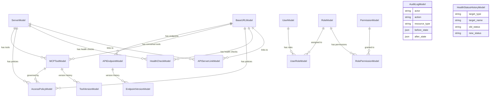
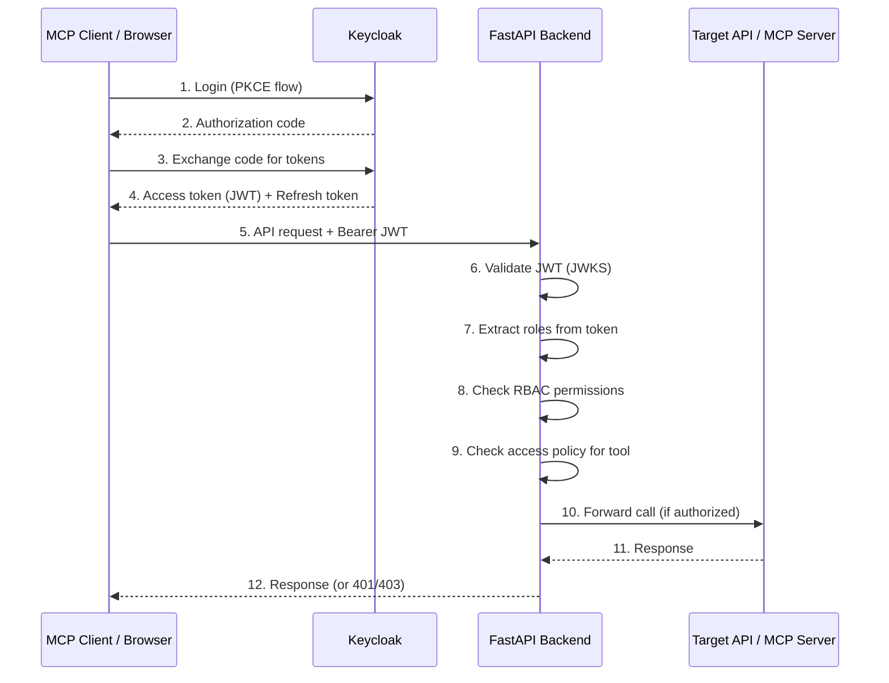
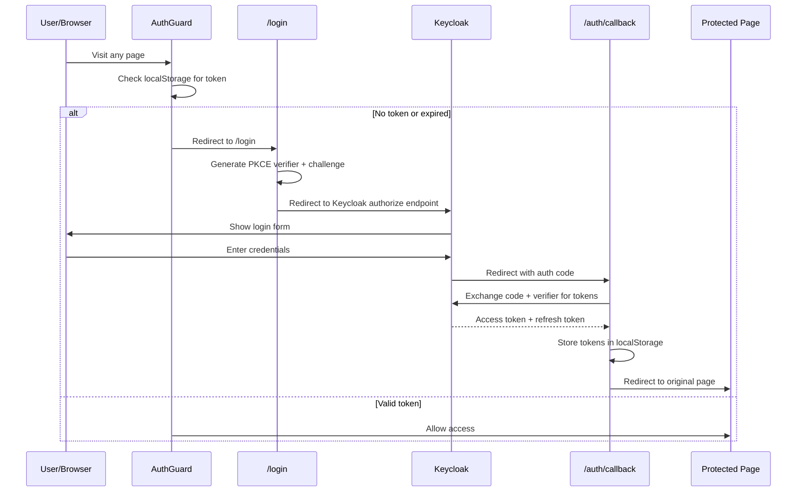
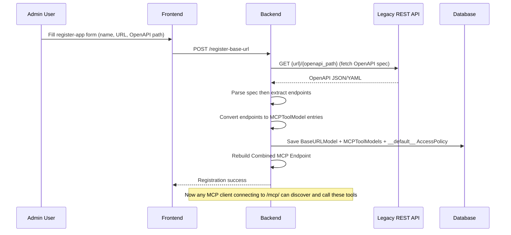
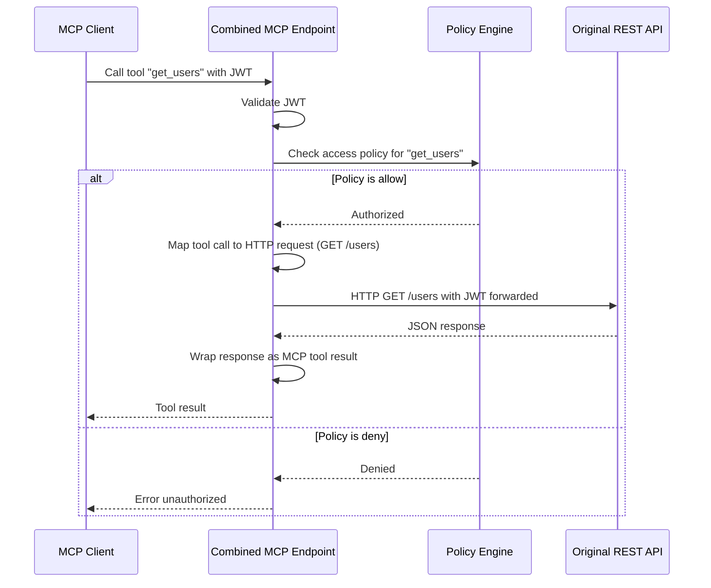
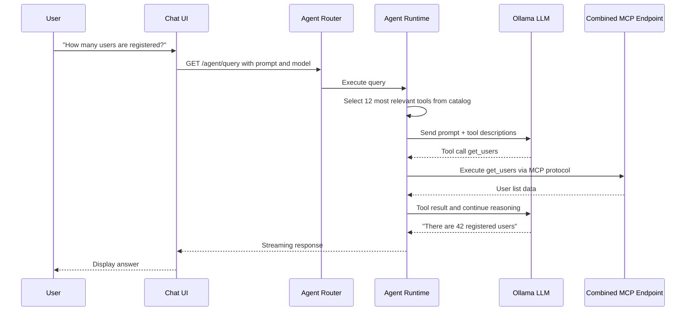
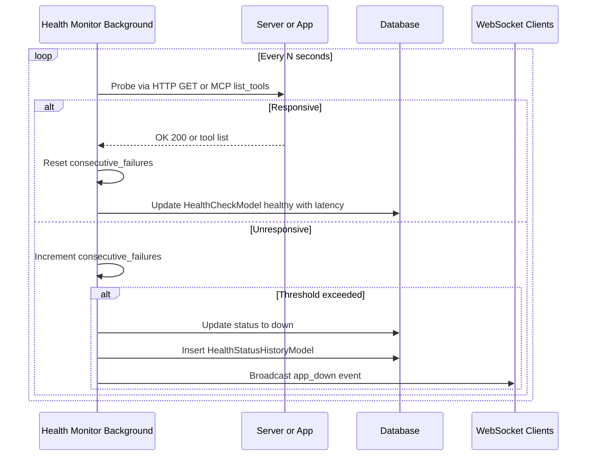

# MCP Server Manager — Complete Application Analysis

> **Purpose of this document**: A comprehensive reference for understanding the entire application — its architecture, every component, data flows, database schema, authentication, API surface, and the product vision. Use this to onboard quickly or resume development in any future session.

---

## Table of Contents

1. [Product Vision & Goal](#1-product-vision--goal)
2. [High-Level Architecture](#2-high-level-architecture)
3. [Project Structure](#3-project-structure)
4. [Backend Deep Dive](#4-backend-deep-dive)
   - [4.1 Entry Point & Startup](#41-entry-point--startup-mainpy)
   - [4.2 Environment Configuration](#42-environment-configuration)
   - [4.3 Database Layer](#43-database-layer)
   - [4.4 Database Models & Relationships](#44-database-models--relationships)
   - [4.5 Authentication & Authorization](#45-authentication--authorization)
   - [4.6 MCP Runtime](#46-mcp-runtime)
   - [4.7 Caching (Redis)](#47-caching-redis)
   - [4.8 Logging](#48-logging)
5. [Backend API Endpoints (Complete Catalog)](#5-backend-api-endpoints-complete-catalog)
6. [Backend Services Layer](#6-backend-services-layer)
7. [Frontend Deep Dive](#7-frontend-deep-dive)
8. [Mock MCP Server](#8-mock-mcp-server)
9. [Docker & Deployment](#9-docker--deployment)
10. [Core Data Flows](#10-core-data-flows)
11. [Current State vs. Desired State](#11-current-state-vs-desired-state)
12. [Key Design Decisions & Constraints](#12-key-design-decisions--constraints)
13. [Technology Stack Summary](#13-technology-stack-summary)
14. [Session & Development Changelog (Recent Upgrades)](#14-session--development-changelog-recent-upgrades)

---

## 1. Product Vision & Goal

### What This Application Is

An **MCP (Model Context Protocol) Server Manager** — a centralized platform that:

1. **Converts legacy/existing REST APIs into MCP-compatible tools** so that any MCP client (Claude, Cursor, custom agents) can invoke them as native MCP tools.
2. **Registers and manages native MCP servers** alongside converted REST API tools in a unified catalog.
3. **Enforces Keycloak-based JWT authentication** on every request — each MCP tool call carries a JWT token so downstream applications can verify authorization before responding.
4. **Provides a governance layer** with RBAC, per-tool access policies (allow/approval/deny), audit logging, and health monitoring.
5. **Includes an AI Agent/Chat interface** (powered by Ollama/LangChain) that can autonomously use the registered MCP tools to answer user queries.

### The Core Problem Solved

Organizations have many existing REST APIs. MCP clients expect tools served via the MCP protocol. This application **bridges the gap** by:

```
┌─────────────┐     ┌──────────────────────┐     ┌─────────────────┐
│  MCP Client │────▶│  MCP Server Manager  │────▶│ Legacy REST API │
│ (Claude,    │     │  (This Application)  │     │ (Any OpenAPI    │
│  Cursor,    │◀────│                      │◀────│  compatible)    │
│  Custom)    │     │  - Converts APIs     │     │                 │
│             │     │  - Enforces Auth     │     ├─────────────────┤
│             │     │  - Access Policies   │     │ Native MCP      │
│             │     │  - Health Monitoring  │     │ Server          │
└─────────────┘     └──────────────────────┘     └─────────────────┘
```

---

## 2. High-Level Architecture

```
┌──────────────────────────────────────────────────────────────────────┐
│                        INFRASTRUCTURE                                │
│                                                                      │
│  ┌──────────┐   ┌───────────┐   ┌──────────┐   ┌──────────────┐    │
│  │ Keycloak │   │ PostgreSQL│   │  Redis   │   │   Ollama     │    │
│  │  (IdP)   │   │ / SQLite  │   │ (Cache)  │   │   (LLM)      │    │
│  └────┬─────┘   └─────┬─────┘   └────┬─────┘   └──────┬───────┘    │
│       │               │              │                 │            │
├───────┼───────────────┼──────────────┼─────────────────┼────────────┤
│       │         BACKEND (FastAPI :8099)                 │            │
│       │               │              │                 │            │
│  ┌────▼─────┐   ┌─────▼─────┐  ┌────▼─────┐   ┌──────▼───────┐    │
│  │   JWT    │   │ SQLAlchemy│  │  Cache   │   │  LangChain   │    │
│  │Validator │   │  Models   │  │  Layer   │   │  Agent +     │    │
│  │ + RBAC   │   │           │  │          │   │  MCPAgent    │    │
│  └────┬─────┘   └─────┬─────┘  └──────────┘   └──────┬───────┘    │
│       │               │                               │            │
│  ┌────▼───────────────▼───────────────────────────────▼────────┐   │
│  │                    ROUTERS (API Layer)                       │   │
│  │  servers │ tools │ endpoints │ base_urls │ agent │ catalog  │   │
│  │  access_policies │ dashboard │ health │ audit               │   │
│  └─────────────────────────┬───────────────────────────────────┘   │
│                            │                                       │
│  ┌─────────────────────────▼───────────────────────────────────┐   │
│  │              COMBINED MCP ENDPOINT (/mcp/)                  │   │
│  │  Merges native MCP tools + converted OpenAPI tools          │   │
│  │  Enforces access policies before forwarding calls           │   │
│  └─────────────────────────┬───────────────────────────────────┘   │
│                            │                                       │
├────────────────────────────┼───────────────────────────────────────┤
│       │                    │                                       │
│  FRONTEND (Next.js :3000)  │    EXTERNAL TARGETS                   │
│  ┌─────────────────┐      │    ┌─────────────────────────────┐    │
│  │ Dashboard       │      ├───▶│ Native MCP Servers (:8001+) │    │
│  │ Register Server │      │    └─────────────────────────────┘    │
│  │ Register App    │      │    ┌─────────────────────────────┐    │
│  │ MCP Endpoints   │      ├───▶│ Legacy REST APIs (any port) │    │
│  │ Chat / Agent    │      │    └─────────────────────────────┘    │
│  │ Playground      │      │                                       │
│  │ Admin Panel     │      │                                       │
│  │ Access Control  │      │                                       │
│  └─────────────────┘      │                                       │
└───────────────────────────┴───────────────────────────────────────┘
```

---

## 3. Project Structure

```
new-docker-img-mcp-07-04-26/
├── docker-compose-offline.yml      # Pre-built image compose
├── docker-compose-setup.yml        # Build-from-source compose
│
├── backend/                        # FastAPI Python Backend
│   ├── Dockerfile / Dockerfile.dev
│   ├── requirements.txt
│   ├── start.sh / run_backend.ps1
│   ├── Software Requirements Specification.txt
│   ├── project.md                  # Project memory/notes
│   └── app/
│       ├── .env                    # Environment variables
│       ├── main.py                 # App entry point (77KB — monolith startup)
│       ├── env.py                  # Typed env config loader
│       ├── __init__.py
│       ├── servers.db              # SQLite fallback database
│       │
│       ├── core/                   # Core infrastructure
│       │   ├── auth.py             # Keycloak endpoint builder
│       │   ├── cache.py            # Redis cache wrapper
│       │   ├── db.py               # DB engine + session factory
│       │   ├── jwt_validator.py    # JWT decode + JWKS verification
│       │   ├── logger.py           # Colorlog setup
│       │   ├── mcp_runtime.py      # FastMCP version adapter
│       │   └── rbac.py             # RBAC permission enforcement
│       │
│       ├── models/
│       │   └── db_models.py        # ALL SQLAlchemy models (19KB)
│       │
│       ├── schemas/
│       │   └── registration.py     # Pydantic request validators
│       │
│       ├── routers/                # API route handlers
│       │   ├── servers.py          # MCP server CRUD + sync
│       │   ├── tools.py            # Tool CRUD
│       │   ├── endpoints.py        # API endpoint CRUD
│       │   ├── base_urls.py        # Application/BaseURL CRUD
│       │   ├── access_policies.py  # Per-tool access control
│       │   ├── agent.py            # LLM agent query + playground
│       │   ├── old_agent.py        # Legacy agent implementation
│       │   ├── catalog.py          # Unified tool catalog
│       │   ├── dashboard.py        # Dashboard stats + sync health
│       │   ├── health.py           # Backend health + WS + auth config
│       │   ├── health_events.py    # Health event broadcaster
│       │   └── audit.py            # Audit log viewer
│       │
│       ├── services/               # Business logic
│       │   ├── keycloak_auth.py    # Keycloak token exchange service
│       │   ├── agent_runtime.py    # MCPAgent wrapper + tool selection
│       │   ├── mcp_client_runtime.py # MCP client for probing servers
│       │   ├── health_monitor.py   # Background health check loop
│       │   ├── audit.py            # Audit log writer
│       │   ├── policy_utils.py     # Access policy helpers
│       │   └── registry/           # Discovery & sync engine
│       │       ├── registry_sync_service.py
│       │       └── exposure_service.py
│       │
│       ├── migrate_exposed_tools.py  # Schema creation migration
│       └── migrate_phase_2.py        # SQLite column migration
│
├── frontend/                       # Next.js 16 + React 19 Frontend
│   ├── Dockerfile / Dockerfile.dev
│   ├── package.json
│   ├── .env.local                  # Frontend env vars
│   ├── tailwind.config.ts
│   ├── tsconfig.json
│   │
│   ├── app/                        # Next.js App Router pages
│   │   ├── layout.tsx              # Root layout with AuthGuard
│   │   ├── page.tsx                # Dashboard (home page)
│   │   ├── providers.tsx           # React Query provider
│   │   ├── globals.css             # Tailwind + custom styles
│   │   ├── login/page.tsx          # Keycloak PKCE login redirect
│   │   ├── auth/callback/page.tsx  # OAuth callback handler
│   │   ├── admin/page.tsx          # Admin control panel
│   │   ├── register-server/page.tsx # Register MCP server form
│   │   ├── register-app/page.tsx   # Register REST API app form
│   │   ├── servers/page.tsx        # Server listing
│   │   ├── mcp-endpoints/page.tsx  # Unified tool/endpoint viewer
│   │   ├── chat/page.tsx           # AI agent chat interface
│   │   ├── playground/page.tsx     # Tool-restricted agent sandbox
│   │   ├── api-explorer/page.tsx   # OpenAPI spec viewer
│   │   ├── access-control/page.tsx # Access policy management
│   │   ├── dashboard/page.tsx      # Dashboard sub-page
│   │   └── api/                    # Next.js API routes
│   │
│   ├── components/
│   │   ├── AuthGuard.tsx           # Auth wrapper (PKCE + token refresh)
│   │   ├── Navigation.tsx          # Top nav bar
│   │   ├── MessageContent.tsx      # Markdown message renderer
│   │   ├── access-control/         # Access control UI components
│   │   └── ui/                     # Reusable UI primitives
│   │
│   ├── lib/
│   │   ├── auth.ts                 # Keycloak OIDC/PKCE auth logic
│   │   ├── agentStream.ts          # SSE stream parser for agent
│   │   ├── env.ts                  # Frontend env reader
│   │   ├── queryClient.ts          # React Query client
│   │   └── toast.ts                # Toast notifications
│   │
│   ├── services/
│   │   ├── http.ts                 # Authenticated fetch wrapper
│   │   └── accessPolicies.api.ts   # Access policy API client
│   │
│   ├── hooks/
│   │   ├── useAccessPolicies.ts    # React Query hook for policies
│   │   └── useDebouncedPolicyUpdate.ts
│   │
│   └── types/
│       └── accessPolicies.ts       # TypeScript type definitions
│
└── mock-mcp-server/                # Development mock MCP server
    ├── Dockerfile / Dockerfile.dev
    ├── requirements.txt
    ├── server.py                   # FastAPI + FastMCP dual-protocol
    ├── readme.md
    └── memory.md
```

---

## 4. Backend Deep Dive

### 4.1 Entry Point & Startup (`main.py`)

The `main.py` file (~78KB) is the monolithic application entry point. On startup it:

1. **Initializes the database** — creates all tables via `Base.metadata.create_all()`
2. **Runs data migrations** — seeds default RBAC roles, permissions, and domain data
3. **Synchronizes access policies** — ensures every registered server/app has a `__default__` access policy
4. **Starts background health monitors** — spawns async tasks that periodically probe all registered servers and apps
5. **Builds the Combined MCP Endpoint** — constructs an ASGI sub-application that merges native MCP tools and converted OpenAPI tools into a single MCP-compatible endpoint
6. **Registers middleware** — CORS (permissive in dev), auth HTTP middleware
7. **Mounts all routers** under their respective prefixes

> **CRITICAL**: The Combined MCP Endpoint (`/mcp/`) is the **central innovation** of this application. It acts as a unified MCP server that aggregates tools from multiple sources and enforces access policies before forwarding tool calls.

### 4.2 Environment Configuration

**File**: `app/env.py` + `app/.env`

Uses `python-dotenv` to load a strongly-typed `BackendEnv` dataclass:

| Variable | Purpose | Default |
|---|---|---|
| `AUTH_ENABLED` | Toggle auth globally | `true` |
| `KEYCLOAK_BASE_URL` | Keycloak server URL | `http://localhost:8080` |
| `KEYCLOAK_REALM` | Keycloak realm name | `mcp-manager` |
| `KEYCLOAK_CLIENT_ID` | OIDC client ID | `mcp-backend` |
| `KEYCLOAK_CLIENT_SECRET` | OIDC client secret | — |
| `DATABASE_URL` | PostgreSQL connection string | — |
| `DB_FALLBACK_SQLITE` | Auto-fallback to SQLite | `true` |
| `REDIS_ENABLED` | Toggle Redis caching | `false` |
| `REDIS_URL` | Redis connection string | `redis://localhost:6379` |
| `OLLAMA_BASE_URL` | Ollama LLM server | `http://localhost:11434` |
| `OLLAMA_MODEL` | Default LLM model | `llama3.2` |
| `AGENT_MCP_SERVER_URL` | MCP endpoint for agent | `http://localhost:8099/mcp/` |

### 4.3 Database Layer

**File**: `app/core/db.py`

- **Primary**: PostgreSQL via `psycopg2-binary`
- **Fallback**: SQLite (`servers.db`) — automatically activated if PostgreSQL is unavailable and `DB_FALLBACK_SQLITE=true`
- **ORM**: SQLAlchemy with declarative models
- **Session Management**: `get_db()` dependency yields scoped sessions

### 4.4 Database Models & Relationships

**File**: `app/models/db_models.py` (~19KB)



#### Key Models

| Model | Purpose | Key Fields |
|---|---|---|
| `ServerModel` | Registered MCP servers | `name`, `url`, `status`, `is_deleted`, `sync_mode`, `discovery_hash` |
| `BaseURLModel` | Registered REST API applications | `name`, `url`, `openapi_path`, `status`, `is_deleted`, `sync_mode` |
| `MCPToolModel` | Unified tool registry (MCP + OpenAPI) | `tool_id`, `name`, `source_type`, `owner_id`, `input_schema`, `is_deleted`, `exposure_approved` |
| `APIEndpointModel` | Individual REST API endpoints | `endpoint_id`, `base_url_name`, `method`, `path`, `parameters`, `is_deleted` |
| `AccessPolicyModel` | Per-tool or default access rules | `owner_id`, `tool_id` (or `__default__`), `mode` (allow/approval/deny) |
| `APIServerLinkModel` | Links BaseURLs to MCP Servers sharing hosts | `base_url_name`, `server_name` |
| `ToolVersionModel` | Tool change history | `tool_id`, `version`, `changed_by`, `change_type`, `snapshot` |
| `EndpointVersionModel` | Endpoint change history | `endpoint_id`, `version`, `changed_by`, `change_type`, `snapshot` |
| `UserModel` | Platform users (synced from Keycloak) | `keycloak_id`, `username`, `email` |
| `RoleModel` | RBAC roles | `name`, `description` |
| `PermissionModel` | Granular permissions | `code` (e.g., `mcp_server:manage`) |
| `UserRoleModel` | User-to-Role mapping | `user_id`, `role_id` |
| `RolePermissionModel` | Role-to-Permission mapping | `role_id`, `permission_id` |
| `AuditLogModel` | Immutable audit trail | `actor`, `action`, `resource_type`, `resource_id`, `before_state`, `after_state` |
| `HealthCheckModel` | Latest health check results | `target_type`, `target_name`, `status`, `latency_ms` |
| `HealthStatusHistoryModel` | Health state transitions | `target_name`, `old_status`, `new_status`, `timestamp` |

### 4.5 Authentication & Authorization

#### JWT Flow



#### Key Auth Files

| File | Role |
|---|---|
| `core/auth.py` | Builds Keycloak URLs (issuer, JWKS endpoint) from env |
| `core/jwt_validator.py` | Cryptographic JWT verification via `PyJWKClient`. Returns `TokenClaims` with user info + merged realm/client roles |
| `core/rbac.py` | `get_request_actor` dependency (decode JWT to actor). `build_require_permission` decorator factory (check DB for role to permission mapping) |
| `services/keycloak_auth.py` | Server-side token exchange with Keycloak (client credentials grant) |
| Frontend `lib/auth.ts` | Full PKCE flow: code_verifier generation, login redirect, token exchange, refresh, logout |
| Frontend `AuthGuard.tsx` | Wraps app — intercepts unauthenticated visits, attempts silent refresh, redirects to `/login` |

#### RBAC Model

```
User → UserRole → Role → RolePermission → Permission
                                            ↓
                              Permission codes like:
                              - mcp_server:manage
                              - mcp_server:view
                              - api_app:manage
                              - tool:manage
```

#### Access Policy Model (Tool-Level)

Each registered Server/App gets a `__default__` access policy. Individual tools can override:

| Mode | Behavior |
|---|---|
| `allow` | Tool is exposed to MCP clients and can be called freely |
| `approval` | Tool requires manual approval before exposure |
| `deny` | Tool is hidden from MCP clients entirely |

### 4.6 MCP Runtime

**File**: `core/mcp_runtime.py`

Provides a compatibility layer that detects and adapts between:
- **`fastmcp` v2** (new standalone package)
- **`mcp.server.fastmcp`** (legacy bundled package)

This ensures the Combined MCP Endpoint works regardless of which version of the `fastmcp` library is installed.

#### Combined MCP Endpoint (`/mcp/`)

The crown jewel — an ASGI sub-application mounted at `/mcp/` that:

1. **Collects native MCP tools** from all registered, healthy MCP servers
2. **Converts OpenAPI endpoints** into MCP tool definitions (name, description, input schema)
3. **Merges** both into a single tool catalog
4. **Enforces access policies** — only tools with `mode=allow` are exposed
5. **Intercepts tool calls** — when an MCP client calls a tool:
   - If it is an OpenAPI tool → forwards as HTTP request to the original REST API
   - If it is a native MCP tool → proxies to the upstream MCP server
6. **Injects JWT tokens** into forwarded requests for authorization

### 4.7 Caching (Redis)

**File**: `core/cache.py`

- Optional Redis-based caching layer
- Functions: `cache_set()`, `cache_get()`, `cache_delete()`, `check_cache_health()`
- **Graceful degradation**: Returns `None` if Redis is disabled or unreachable
- Used for caching tool catalogs, health check results

### 4.8 Logging

**File**: `core/logger.py`

- Uses `colorlog` for colored console output
- Standard `get_logger(name)` factory ensures uniform formatting
- Log levels: DEBUG in development, INFO in production

---

## 5. Backend API Endpoints (Complete Catalog)

### Server Management

| Method | Path | Purpose |
|---|---|---|
| `POST` | `/discover-server-tools` | Discover tools from an MCP server URL without registering |
| `POST` | `/register-server` | Register or update an MCP server + initialize default access policy |
| `GET` | `/servers` | List all registered MCP servers |
| `GET` | `/servers/status` | Health/status rollup for all servers |
| `GET` | `/servers/{server_name}/status` | Health/status for a single server |
| `GET` | `/servers/{server_name}/tools` | List tools from a specific server with effective policy modes |
| `PATCH` | `/servers/{server_name}` | Update server metadata/settings |
| `DELETE` | `/servers/{server_name}` | Soft-delete or hard-delete a server |
| `POST` | `/servers/{server_name}/sync` | Manual discovery + registry sync |

### Application / Base URL Management

| Method | Path | Purpose |
|---|---|---|
| `POST` | `/register-base-url` | Register or update a REST API application |
| `GET` | `/base-urls` | List all registered applications |
| `GET` | `/openapi-spec` | Fetch and validate OpenAPI spec for a URL |
| `PATCH` | `/base-urls/{name}` | Update application metadata |
| `DELETE` | `/base-urls/{name}` | Soft-delete or hard-delete an application |
| `POST` | `/base-urls/{name}/sync` | Manual OpenAPI discovery + sync |

### Tool Management

| Method | Path | Purpose |
|---|---|---|
| `GET` | `/tools` | List all non-deleted tools |
| `POST` | `/tools` | Manually create a tool |
| `PATCH` | `/tools/{tool_id}` | Update tool metadata + version history |
| `DELETE` | `/tools/{tool_id}` | Soft-delete or hard-delete a tool |

### Endpoint Management

| Method | Path | Purpose |
|---|---|---|
| `GET` | `/endpoints` | List all non-deleted API endpoints |
| `POST` | `/endpoints` | Create an API endpoint |
| `PATCH` | `/endpoints/{endpoint_id}` | Update endpoint metadata + version history |
| `DELETE` | `/endpoints/{endpoint_id}` | Soft-delete or hard-delete an endpoint |

### Access Policies

| Method | Path | Purpose |
|---|---|---|
| `GET` | `/access-policies` | List all access policies grouped by owner |
| `PUT` | `/access-policies/{owner_id}` | Update default policy for an owner |
| `PUT` | `/access-policies/{owner_id}/{tool_id}` | Create/update per-tool policy |
| `DELETE` | `/access-policies/{owner_id}/{tool_id}` | Delete per-tool policy (reverts to default) |
| `POST` | `/access-policies/{owner_id}/apply-all` | Bulk apply one mode to all tools |

### Agent / Chat

| Method | Path | Purpose |
|---|---|---|
| `GET` | `/agent/query` | Execute prompt via LLM agent (streaming response) |
| `GET` | `/agent/models` | List available Ollama models |
| `POST` | `/agent/playground/query` | Execute prompt restricted to specific tools |

### Catalog

| Method | Path | Purpose |
|---|---|---|
| `GET` | `/mcp/openapi/catalog` | Unified tool catalog (MCP + OpenAPI) with policy filtering |
| `GET` | `/mcp/openapi/diagnostics` | OpenAPI sync diagnostics per app |

### Dashboard

| Method | Path | Purpose |
|---|---|---|
| `GET` | `/dashboard/stats` | Live dashboard cards (server/app counts, tool counts, health) |
| `GET` | `/dashboard/sync-health` | Registry sync lifecycle states + stale tool detection |

### Health & System

| Method | Path | Purpose |
|---|---|---|
| `GET` | `/health` | Backend health + auth/DB runtime flags |
| `GET` | `/auth/config` | Public Keycloak OIDC configuration (for frontend) |
| `WS` | `/ws/health` | WebSocket for real-time health event broadcasting |
| `GET` | `/audit-logs` | Query audit trail with before/after snapshots |

---

## 6. Backend Services Layer

### `services/keycloak_auth.py`
Handles server-side Keycloak operations — token exchange via client credentials grant, token introspection.

### `services/agent_runtime.py`
Wraps `mcp_use.agents.mcpagent.MCPAgent` with LangChain/ChatOllama:
- **Context Window Protection**: Lightweight keyword tokenizer (`_select_relevant_tools`) filters to the 12 most relevant tools before passing to LLM
- **Bypass Directives**: Detects documentation/listing queries and bypasses MCP agent, returning catalog data directly
- Streaming responses to client

### `services/mcp_client_runtime.py`
Creates `MCPClient` instances to probe external MCP servers — used during registration and health checks to verify connectivity and discover available tools.

### `services/health_monitor.py`
Background `asyncio.TaskGroup` loop:
- Periodically pings all registered BaseURLs (HTTP GET) and MCP Servers (`list_tools`)
- Tracks `consecutive_failures` to determine `healthy` / `degraded` / `down`
- State transitions create `HealthStatusHistoryModel` records
- Emits real-time WebSocket events (`app_recovered`, `app_down`) via `HealthEventBroadcaster`

### `services/audit.py`
`write_audit_log_fn()` captures actor, action, resource type/ID, and JSON snapshots of before/after state for every mutating operation.

### `services/policy_utils.py`
Helpers for access policy resolution:
- `ensure_default_access_policy_for_owner_fn()` — auto-creates `__default__` policy on registration
- Policy inheritance: per-tool policy > owner default > system default

### `services/registry/`

| File | Purpose |
|---|---|
| `registry_sync_service.py` | Reconciles discovered tool snapshots with DB (insert new, update changed, soft-delete missing). Tracks `discovery_hash` to skip no-op syncs |
| `exposure_service.py` | `resolve_exposable_tools()` — filters tools by access policy + parent health/enabled status. Used by catalog endpoint |

---

## 7. Frontend Deep Dive

### Tech Stack
- **Framework**: Next.js 16 (App Router) + React 19 + TypeScript
- **Styling**: Tailwind CSS v4 with PostCSS
- **State**: React hooks + `@tanstack/react-query` for server state
- **Auth**: Keycloak OIDC with PKCE flow

### Pages / Routes

| Route | Purpose | Key Features |
|---|---|---|
| `/` | **Dashboard** | Server count, uptime, latency, system health cards, WebSocket updates |
| `/login` | **Login** | Redirects to Keycloak with PKCE challenge |
| `/auth/callback` | **OAuth Callback** | Exchanges code for tokens, stores in localStorage |
| `/register-server` | **Register MCP Server** | Form to add MCP server URL + name, triggers probe |
| `/register-app` | **Register REST API** | Form to add app base URL + OpenAPI path |
| `/servers` | **Server List** | Table of all registered servers |
| `/mcp-endpoints` | **MCP Endpoints** | Unified tool/endpoint viewer with access mode indicators |
| `/chat` | **AI Chat** | Conversational interface, model selector, streaming responses |
| `/playground` | **Tool Sandbox** | Restrict agent to specific tools for testing |
| `/api-explorer` | **API Explorer** | Swagger-like OpenAPI viewer via backend proxy |
| `/admin` | **Admin Panel** | Tabbed: Overview, Applications, Servers, Tools, Endpoints, Audit Logs |
| `/access-control` | **Access Control** | Per-tool policy editor (currently behind feature flag) |

### Authentication Flow (Frontend)



### Key Frontend Components

| Component | Role |
|---|---|
| `AuthGuard.tsx` | Wraps entire app. Checks auth state, handles silent refresh, redirects unauthenticated users |
| `Navigation.tsx` | Top navigation bar with responsive mobile menu, route highlighting, logout |
| `MessageContent.tsx` | Renders markdown/rich content from AI agent responses |
| `access-control/*` | Modal and card components for policy management |
| `ui/Button.tsx`, `ui/Card.tsx` | Design system primitives |

### API Integration Pattern

All API calls flow through `services/http.ts`:

```typescript
// Automatically injects Bearer token from localStorage
const response = await authenticatedFetch('/api/servers');

// Handles 401 → redirect to login
// Handles token refresh automatically
```

### Environment Variables (Frontend)

```env
NEXT_PUBLIC_API_URL=http://localhost:8099     # Backend API base
NEXT_PUBLIC_KEYCLOAK_URL=http://localhost:8080 # Keycloak server
NEXT_PUBLIC_KEYCLOAK_REALM=mcp-manager        # Keycloak realm
NEXT_PUBLIC_KEYCLOAK_CLIENT_ID=mcp-frontend   # OIDC client ID
```

---

## 8. Mock MCP Server

### Purpose
A **development-only** sandbox server for testing the MCP Server Manager without real external services.

### Protocol
**Dual-protocol** — serves both REST and MCP on the same process:
- REST endpoints at `/` (root)
- MCP (Streamable HTTP) at `/mcp/`

### MCP Tools Provided (9 total)

| Tool | Description | Parameters |
|---|---|---|
| `add` | Adds two numbers | `a: float`, `b: float` |
| `get_current_time` | Returns current UTC timestamp | — |
| `random_number` | Random integer in range | `low: int`, `high: int` |
| `reverse_string` | Reverses text | `text: str` |
| `word_count` | Counts words/chars | `text: str` |
| `get_user` | Look up mock user by ID | `user_id: str` |
| `create_note` | Create a mock note | `user_id: str`, `content: str` |
| `transform_case` | Change text case | `text: str`, `case: str` |
| `calculate` | Basic math operations | `operation: str`, `a: float`, `b: float` |

### REST Endpoints

| Path | Method | Purpose |
|---|---|---|
| `/health` | GET | Health check |
| `/info` | GET | Server info |
| `/users` | GET, POST | Mock users CRUD |
| `/users/{id}` | GET, DELETE | Single user ops |
| `/notes` | GET, POST | Mock notes CRUD |
| `/notes/{id}` | GET, DELETE | Single note ops |
| `/echo` | POST | Echo back request body |
| `/random` | GET | Random number |
| `/time` | GET | Current time |
| `/calculate` | POST | Calculator |

### MCP Resources

| URI | Description |
|---|---|
| `data://users/all` | All mock users |
| `data://notes/all` | All mock notes |
| `data://server/info` | Server metadata |
| `data://config/roles` | Available roles |

### MCP Prompts

| Prompt | Purpose |
|---|---|
| `greeting_prompt` | Generate a greeting |
| `summarise_prompt` | Summarize text |
| `bullets_to_prose_prompt` | Convert bullets to prose |
| `code_review_prompt` | Review code snippet |

> **WARNING**: The mock server has **NO authentication**. No JWT validation, no Keycloak integration. It uses a simulated role system purely in-memory. CORS is fully permissive (`*`). A RapidAPI key is hardcoded in plain text.

---

## 9. Docker & Deployment

### Docker Compose (Build)

```yaml
services:
  backend:
    build: ./backend
    image: mcp-backend:070426
    ports: ["8099:8099"]

  frontend:
    build: ./frontend
    image: mcp-frontend:070426
    ports: ["3000:3000"]

  # mock-server (optional):
  #   build: ./mock-mcp-server
  #   ports: ["8001:8001"]
```

### Docker Compose (Pre-built)

```yaml
services:
  backend:
    image: new-docker-img-mcp-07-04-26-backend:latest
    volumes: ["./backend/app:/app"]
    ports: ["8000:8000"]

  frontend:
    image: new-docker-img-mcp-07-04-26-frontend:latest
    volumes: ["./frontend:/app", "/app/node_modules"]
    ports: ["3000:3000"]
```

### Port Mapping

| Service | Dev Port | Prod Port |
|---|---|---|
| Backend | 8099 (also 8090 via PowerShell, 8091 via start.sh) | 8099 |
| Frontend | 3000 | 3000 |
| Mock MCP Server | 8001 | 8001 |
| Keycloak | 8080 | 8080 |
| PostgreSQL | 5432 | 5432 |
| Redis | 6379 | 6379 |
| Ollama | 11434 | 11434 |

---

## 10. Core Data Flows

### Flow 1: Register a Legacy REST API and Expose as MCP Tools



### Flow 2: MCP Client Calls a Converted API Tool



### Flow 3: AI Agent Query



### Flow 4: Health Monitoring



---

## 11. Current State vs. Desired State

### What Already Works

| Feature | Status | Notes |
|---|---|---|
| MCP Server registration + discovery | Working | Full CRUD + sync |
| REST API (BaseURL) registration | Working | OpenAPI spec parsing |
| OpenAPI to MCP tool conversion | Working | Automatic via registry sync |
| Combined MCP Endpoint (`/mcp/`) | Working | Merges both sources |
| Access policies (allow/approval/deny) | Working | Per-tool granularity |
| Keycloak JWT validation (backend) | Working | JWKS verification |
| RBAC permission enforcement | Working | Role to Permission model |
| Frontend auth (PKCE flow) | Working | Full Keycloak integration |
| Health monitoring + WebSocket | Working | Background async loop |
| AI Agent chat (Ollama/LangChain) | Working | Streaming, tool selection |
| Playground (restricted tools) | Working | Sandbox testing |
| Audit logging | Working | Before/after snapshots |
| Dashboard analytics | Working | Live stats + sync health |
| Docker deployment | Working | Compose files ready |

### Desired Enhancements (MCP Server Manager Vision)

| Feature | Status | Description |
|---|---|---|
| JWT forwarding to downstream APIs | Partial | Combined endpoint should forward JWT to all target APIs so they can verify authorization |
| Per-user tool authorization | Needed | Current access policies are at tool level, not user level. Need user-scoped policies |
| Multi-tenant Keycloak integration | Needed | Support multiple realms or clients for different API consumers |
| MCP client authentication | Needed | MCP clients need to authenticate via Keycloak before accessing `/mcp/` |
| Token exchange / delegation | Needed | Backend should perform token exchange when calling downstream APIs on behalf of a user |
| Rate limiting per user/client | Needed | Prevent abuse of exposed MCP tools |
| Tool usage analytics | Needed | Track which users call which tools, how often |
| Webhook notifications | Needed | Notify on policy violations, health changes |
| Mock server auth | Missing | Mock server has zero auth — needs JWT verification for realistic testing |

---

## 12. Key Design Decisions & Constraints

1. **Monolithic `main.py`**: The startup logic (~78KB) handles DB init, migrations, access policy sync, health monitors, and combined MCP endpoint construction all in one file. Consider refactoring into lifecycle modules.

2. **SQLite Fallback**: Enables zero-config development but means some features (concurrent writes, migrations) behave differently than production PostgreSQL.

3. **Combined MCP Endpoint Pattern**: Instead of running separate MCP servers per registered app, a single endpoint aggregates everything. This simplifies client configuration but creates a single point of failure.

4. **Access Policy Inheritance**: Per-tool policies override the owner's `__default__` policy, which in turn overrides the system default. This three-tier model provides flexibility.

5. **Agent Context Window Protection**: The 12-tool limit with keyword-based relevance scoring prevents overwhelming the LLM context window, but may miss relevant tools for ambiguous queries.

6. **Soft Delete Pattern**: All major entities use `is_deleted` flag rather than hard deletion, preserving audit trail integrity.

7. **Dual-Protocol Mock Server**: The mock serves both REST and MCP on the same process, making it easy to test both API conversion and native MCP scenarios.

---

## 13. Technology Stack Summary

### Backend

| Category | Technology |
|---|---|
| Framework | FastAPI |
| Language | Python 3.11+ |
| Database | PostgreSQL (primary) / SQLite (fallback) |
| ORM | SQLAlchemy |
| Auth | Keycloak + PyJWT + PyJWKClient |
| Caching | Redis |
| MCP | fastmcp / mcp (dual support) |
| AI/LLM | LangChain + Ollama + mcp_use |
| Server | Uvicorn |
| Validation | Pydantic |
| Logging | colorlog |

### Frontend

| Category | Technology |
|---|---|
| Framework | Next.js 16 (App Router) |
| Language | TypeScript |
| UI Library | React 19 |
| Styling | Tailwind CSS v4 |
| State | React hooks + @tanstack/react-query |
| Auth | Keycloak OIDC (PKCE flow) |
| HTTP | Custom authenticatedFetch wrapper |

### Infrastructure

| Category | Technology |
|---|---|
| Containerization | Docker + Docker Compose |
| Identity Provider | Keycloak |
| LLM Server | Ollama |
| Cache | Redis |

---

---

## 14. Session & Development Changelog (Recent Upgrades)

### 14.1 OpenAPI Spec Candidate Fetching & Docker Host Networking
- **Host Network Mode (`docker-compose-offline.yml`)**: Set `network_mode: host` and `command: uvicorn main:app --host 0.0.0.0 --port 8000 --reload` for the backend service. This prevents Docker bridge network isolation from dropping packets destined for host processes (e.g., student API on `http://10.139.10.176:5555/openapi.json`).
- **URL Candidate Building & Diagnostic Fetch (`backend/app/main.py`)**: Added `.rstrip(":")` in `build_openapi_candidates()` to sanitize input URLs and path candidates, automatically generating `host.docker.internal` fallbacks and unauthenticated GET attempts for public specs.

### 14.2 Secure HTTP Cookie Authentication & Dev Admin Fallback
- **Frontend Cookie Management (`frontend/lib/auth.ts` & `frontend/services/http.ts`)**:
  - Implemented `setCookie()`, `getCookie()`, and `deleteCookie()` for `mcp_access_token`, `mcp_refresh_token`, and `mcp_token_expiry` with `SameSite=Lax`, `Path=/`, and early expiration handling.
  - Added `credentials: 'include'` to `authenticatedFetch()` and `http()` to ensure browser cookies are attached to all API requests automatically.
- **Backend Cookie Extraction (`backend/app/core/rbac.py` & `backend/app/main.py`)**:
  - `_extract_bearer_token()` inspects both `Authorization: Bearer <token>` header AND `request.cookies.get("mcp_access_token")`.
  - In development mode (`ENV=development`), `get_request_actor()` falls back gracefully to the administrator identity (`username="admin"`, `roles=["super_admin"]`) if a Keycloak Bearer token is missing or expired, preventing sudden 401 redirects during active form edits.

### 14.3 Application & Tool Endpoint Selection Synchronization
- **Database Tool State Sync (`backend/app/routers/base_urls.py`)**:
  - Added `_sync_app_tools_selection(db, app_name, selected_endpoints)` in `base_urls.py`.
  - Whenever `PATCH /base-urls/{name}` or `POST /register-base-url` updates an application's `selected_endpoints`, all matching tool rows in `MCPToolModel` table (under `owner_id = "app:{name}"`) are updated with `is_enabled`, `owner_enabled`, `is_deleted`, `registration_state`, and `exposure_state`.

### 14.4 Agent Playground Architecture & Port Corrections
- **Backend Port Configuration (`backend/app/.env` & `backend/app/env.py`)**: Updated `AGENT_MCP_SERVER_URL` to `http://127.0.0.1:8000/mcp/apps/` (correcting port `8099` typo).
- **ASGI Middleware Loopback Exemption (`backend/app/main.py`)**: Updated `JWTAuthASGIMiddleware` to allow internal loopback calls (`127.0.0.1`) without issuing OAuth `WWW-Authenticate` challenges that crash automated client loops.
- **Tool Call Rescuing & Flat OpenAPI Parameter Mapping (`backend/app/routers/agent.py` & `backend/app/main.py`)**:
  - Updated `generate_direct_response()` to detect `AIMessage.tool_calls` when content is empty and format it into a structured tool call.
  - Enhanced `_parse_raw_tool_call()` to extract JSON tool calls wrapped in markdown code blocks or text.
  - Added in-process tool execution fallback (`combined_apps_mcp.call_tool()`).
  - Updated `invoke_openapi_tool()` to extract path template parameters (like `{student_id}`) from flat top-level argument dictionaries.

### 14.5 Human-Readable Markdown UI Rendering Engine
- **Frontend Markdown Component (`frontend/components/MessageContent.tsx`)**:
  - Replaced rigid `lines.every(...)` list check with a full React Markdown renderer supporting:
    - **Headings** (`#`, `##`, `###`) ➔ Rendered as styled font-bold heading tags (`<h1>`, `<h2>`, `<h3>`).
    - **Bold text** (`**text**`) ➔ Rendered as `<strong>` tags.
    - **Italic text** (`_text_` / `*text*`) ➔ Rendered as `<em>` tags.
    - **Inline Code Badges** (`` `code` ``) ➔ Rendered as styled rose-accented inline code pills.
    - **Nested Bullet Lists & Indented Trees** ➔ Rendered with indented bullets and clean label formatting.
    - **Markdown Tables** (`| Col 1 | Col 2 |`) ➔ Rendered as styled responsive HTML tables with headers and alternating hover states.
    - **Horizontal Rules** (`---`) ➔ Rendered as clean subtle divider lines.
### 14.5 Human-Readable Markdown UI Rendering Engine
- **Frontend Markdown Component (`frontend/components/MessageContent.tsx`)**:
  - Replaced rigid `lines.every(...)` list check with a full React Markdown renderer supporting:
    - **Headings** (`#`, `##`, `###`) ➔ Rendered as styled font-bold heading tags (`<h1>`, `<h2>`, `<h3>`).
    - **Bold text** (`**text**`) ➔ Rendered as `<strong>` tags.
    - **Italic text** (`_text_` / `*text*`) ➔ Rendered as `<em>` tags.
    - **Inline Code Badges** (`` `code` ``) ➔ Rendered as styled rose-accented inline code pills.
    - **Nested Bullet Lists & Indented Trees** ➔ Rendered with indented bullets and clean label formatting.
    - **Markdown Tables** (`| Col 1 | Col 2 |`) ➔ Rendered as styled responsive HTML tables with headers and alternating hover states.
    - **Horizontal Rules** (`---`) ➔ Rendered as clean subtle divider lines.
- **Unwrapped Technical Headers (`backend/app/routers/agent.py`)**:
  - Updated `_format_tool_result_human_readable()` to strip internal HTTP metadata (`status_code`, `ok`, `url`, `content_type`), formatting core payload data directly into clean Markdown bullet lists and tables with an execution summary footer.

### 14.6 Multi-Tenant Developer Isolation & RBAC Control Plane
- **Developer Ownership Filtering**: Enforced strict `created_by_user_id` filtering across `catalog.py`, `servers.py`, `base_urls.py`, `tools.py`, `endpoints.py`, and `dashboard.py`. Developers can only view and manage resources registered under their own user ID.
- **Role-Based Admin Access**: Updated `Navigation.tsx` and `app/admin/page.tsx` so developer roles can visit `/admin` with role-restricted views (hiding the global Audit Logs tab). Audit log endpoints are strictly guarded by `Depends(require_role(["admin"]))`.
- **Redis Cache Key Namespacing**: Appended user subject tokens (`user_sub`) to cache keys across status endpoints (`status:servers:...:{sub}`) to prevent cross-tenant cache contamination.

### 14.7 Combined MCP Server Transport Compliance & Multi-Channel Auth
- **Streamable HTTP & SSE Transport**: Mounted FastMCP 3.4.4 combined server under `/mcp/apps` and `/mcp/apps/`.
- **Multi-Channel Authentication**: Updated `JWTAuthASGIMiddleware` in `main.py` to extract and validate tokens across three channels: `Authorization: Bearer <token>` header, HttpOnly cookies (`access_token`, `mcp_access_token`), and URL query parameters (`?token=<token>`, `?access_token=<token>`).
- **JSON-RPC 2.0 Client Verification**: Verified standard MCP protocol handshake (`initialize`), tool discovery (`tools/list` returning 30 tools), and tool execution (`tools/call` returning `structuredContent`).

### 14.8 Automatic Database Schema Auto-Migration on Boot
- **Startup Column Auto-Sync**: Added `ensure_dynamic_schema_migrations()` inside `init_db()` in `backend/app/main.py`.
- **Dynamic Model Inspection**: Automatically compares all SQLAlchemy model declarations in `Base.metadata.tables` against live database tables and executes `ALTER TABLE "table_name" ADD COLUMN IF NOT EXISTS "col_name" col_type` on application boot without manual migration scripts.

### 14.9 Frontend Proxy Routing & Candidate Origin Optimization
- **Proxy Failover & Error Handling**: Optimized `handleProxy()` in `frontend/app/api/proxy/[...path]/route.ts` with streamlined backend candidate origins (`http://mcp-backend:8000`, `http://127.0.0.1:8000`, `http://host.docker.internal:8000`). Fixed missing `authenticatedFetch` import on `/admin`.
- **Clean 503 JSON Fallback**: Configured proxy to return a clean JSON `503 Service Unavailable` response during backend service initialization/reboot instead of outputting uncaught `ECONNREFUSED` stack traces.

### 14.10 Comprehensive Software Approval Documentation Suite
- **Generated Approval Artifacts**: Compiled 7 formal software approval documents in Microsoft Word (`.docx`) and Markdown format stored in `documents/`:
  1. `System_Architecture_and_Workflow_Guide.docx` / `system_architecture_and_workflow_guide.md`
  2. `Software_Deployment_Plan.docx`
  3. `Software_Requirements_Specification.docx`
  4. `Test_Plan.docx`
  5. `User_Manual.docx`
  6. `Release_Notes.docx`
  7. `Domain_Driven_Design.docx`
- **Embedded Architecture Flowcharts**: Generated and embedded high-resolution topology diagrams, test result breakdowns, and sequence flowcharts into docx documents.

---

> **Quick Start for Development**:
> 1. Start Keycloak, PostgreSQL (or use SQLite fallback), and Ollama
> 2. `cd backend && uvicorn app.main:app --host 0.0.0.0 --port 8000 --reload`
> 3. `cd frontend && npm run dev` (port 3000)
> 4. Optionally: `cd mock-mcp-server && uvicorn server:app --port 8001 --reload`
> 5. Access dashboard at `http://localhost:3000`


