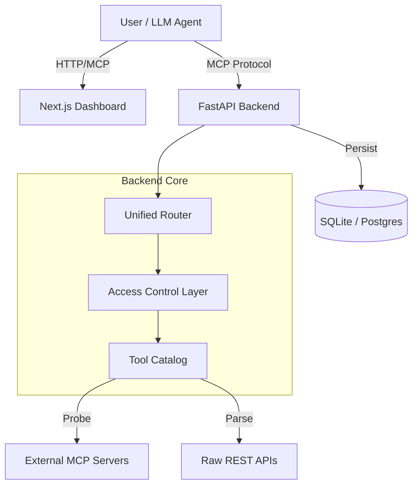

# MCP Server Manager

**MCP Server Manager** is a full-stack platform designed to centralize the registration, monitoring, management, and exposure of APIs as Model Context Protocol (MCP) servers. It bridges the gap between raw APIs and LLM agents, providing a unified interface for tool discovery, access control, and observability.

## 🚀 Features

-   **Server Registration**: Register external MCP servers and raw API base URLs.
-   **Dynamic Tool Discovery**: Automatically parses OpenAPI specifications and native MCP tools.
-   **Unified MCP Endpoint**: Exposes a combined `/mcp/apps` endpoint that proxies calls to underlying services.
-   **Granular Access Control**:
    -   Role-Based permission model (Allow/Approvals/Deny).
    -   Granular control per-tool and per-user/group.
    -   Interactive UI for policy management.
-   **Dashboard**:
    -   Real-time status monitoring of registered servers.
    -   API Explorer for inspecting available tools.
    -   Interactive Chat interface for testing tool calls.
-   **Resilience**: Fallback mechanisms (Postgres with SQLite fallback), auto-healing connections.

## 🛠️ Tech Stack

-   **Backend**: FastAPI, SQLAlchemy, Pydantic, Uvicorn.
-   **Frontend**: Next.js (App Router), React 19, Tailwind CSS v4, React Query, Lucide Icons.
-   **Database**: PostgreSQL (Primary) / SQLite (Fallback).
-   **Auth**: Keycloak integration (Architecture ready), RBAC.

## 📦 Getting Started

### Prerequisites
-   Python 3.10+
-   Node.js 18+
-   Git

### 1. Backend Setup

```bash
cd backend
python -m venv venv
# Windows
.\venv\Scripts\activate
# Linux/Mac
source venv/bin/activate

pip install -r requirements.txt

# Run the server
python main.py
# Server runs at http://localhost:8090
```

### 2. Frontend Setup

```bash
cd frontend/mcp-dashboard
npm install

# Run the development server
npm run dev
# Dashboard runs at http://localhost:3000
```

## 🏗️ Architecture



